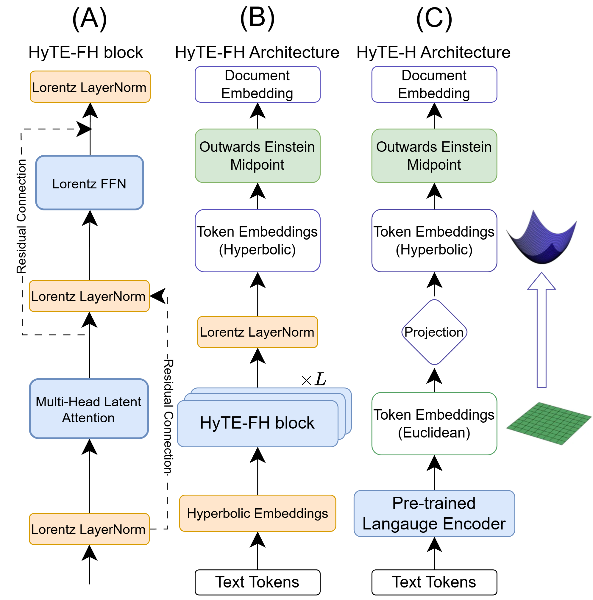
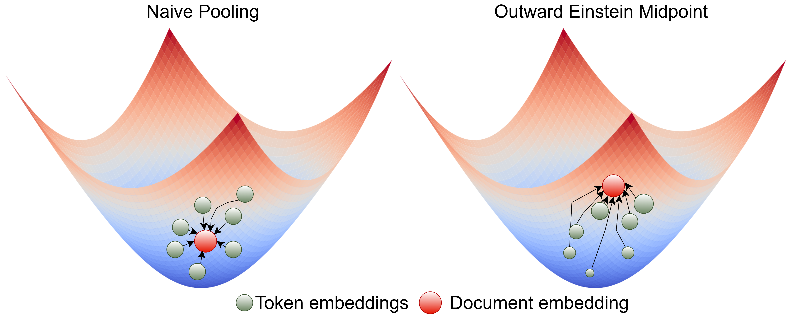

# HypRAG

This repository contains code for training and evaluating hyperbolic embedding models for retrieval-augmented generation (RAG) tasks. The project explores the use of hyperbolic geometry in neural network representations, particularly for contrastive learning and masked language modeling.

## Overview
### Model Framework


### Outward Einstein Midpoint



The project implements:

- **Masked Language Model (MLM) Pre-training**: Training ALBERT-style models with ModernBERT architecture
- **Contrastive Pre-training**: Learning hyperbolic embeddings with various distance functions
- **Evaluation Pipelines**: Comprehensive evaluation on MTEB and RAGAS benchmarks

## Project Structure

```
.
├── configs/
│   ├── train/
│   │   ├── albert_mlm_modernbert.yaml
│   │   └── contrastive_pretrain_albert.yaml
│   └── deepspeed/
│       └── ds_config.json
├── train.py
├── eval_mteb_hyperbolic.py
└── eval_ragas.py
```

## Requirements

- Python 3.8+
- PyTorch
- CUDA 12.1+
- DeepSpeed
- Transformers
- MTEB

## Installation

```bash
# Clone the repository
git clone <repository-url>
cd hyperbolic-rag

# Create conda environment
conda create -n hyprag python=3.10
conda activate hyprag

# Install dependencies
pip install -r requirements.txt
```

## Environment Variables

Create a `.env` file with the following variables:

```bash
MDS_PRETRAIN_DATA_PATH=/path/to/pretrain/data
OUTPUT_DIR=/path/to/output
HF_TOKEN=your_huggingface_token
HF_HOME=/path/to/hf/cache
TRANSFORMERS_CACHE=/path/to/transformers/cache
HF_DATASETS_CACHE=/path/to/datasets/cache
```

## Training

### Masked Language Model Pre-training

Train an ALBERT model with ModernBERT architecture:

```bash
deepspeed --num_gpus=4 train.py \
    --config=configs/train/albert_mlm_modernbert.yaml \
    --deepspeed_config=configs/deepspeed/ds_config.json
```

To resume from a checkpoint:

```bash
deepspeed --num_gpus=4 train.py \
    --config=configs/train/albert_mlm_modernbert.yaml \
    --deepspeed_config=configs/deepspeed/ds_config.json \
    --train_args.checkpoint=/path/to/checkpoint
```

### Contrastive Pre-training

Train hyperbolic embeddings with contrastive learning:

```bash
# Using torchrun
torchrun --nproc-per-node=4 train.py \
    --config=configs/train/contrastive_pretrain_albert.yaml \
    --train_args.dtype=bf16 \
    --train_args.distance=lorentz_inner \
    --train_args.learning_rate=5e-4 \
    --train_args.weight_decay=0.01 \
    --model_args.model_name=/path/to/pretrained/mlm/model \
    --model_args.pooling=outward_einstein_midpoint \
    --model_args.trainable_curvature=False \
    --data_args.data_path=$MDS_PRETRAIN_DATA_PATH \
    --train_args.output_dir=$OUTPUT_DIR/experiment_name \
    --train_args.wandb_run_name=experiment_name

# Using DeepSpeed
deepspeed --num_gpus=4 train.py \
    --config=configs/train/contrastive_pretrain_albert.yaml \
    --train_args.distance=geodesic \
    ...
```

#### Key Training Arguments

| Argument | Description | Options |
|----------|-------------|---------|
| `train_args.dtype` | Data type for training | `bf16`, `fp16`, `fp32` |
| `train_args.distance` | Distance function in hyperbolic space | `lorentz_inner`, `geodesic` |
| `train_args.learning_rate` | Learning rate | e.g., `5e-4` |
| `train_args.weight_decay` | Weight decay | e.g., `0.01` |
| `model_args.pooling` | Pooling strategy | `outward_einstein_midpoint` |
| `model_args.trainable_curvature` | Whether to learn curvature | `True`, `False` |

## Evaluation

### MTEB Benchmark

Evaluate on the Massive Text Embedding Benchmark:

```bash
python eval_mteb_hyperbolic.py \
    --model /path/to/model \
    --output_dir ./results/mteb \
    --scoring <scoring_method> \
    --hybrid
```

### RAGAS Evaluation

Evaluate retrieval quality on RAG benchmarks:

```bash
python eval_ragas.py \
    --model_path /path/to/model \
    --hyperbolic \
    --dataset <dataset_name> \
    --output ./results/ragas \
    --base_model_type albert \
    --top_k 10
```

#### Supported Datasets

- `covidqa` - COVID-19 question answering
- `cuad` - Contract understanding
- `emanual` - E-manual question answering
- `delucionqa` - Delusion detection QA
- `expertqa` - Expert domain question answering

## Hyperbolic Geometry Components

### Distance Functions

- **Lorentz Inner Product** (`lorentz_inner`): Computes similarity using the Lorentz inner product in the hyperboloid model
- **Geodesic Distance** (`geodesic`): Computes the geodesic (shortest path) distance in hyperbolic space

### Pooling Strategies

- **Outward Einstein Midpoint** (`outward_einstein_midpoint`): Aggregates token embeddings using the Einstein midpoint in the Poincaré ball model